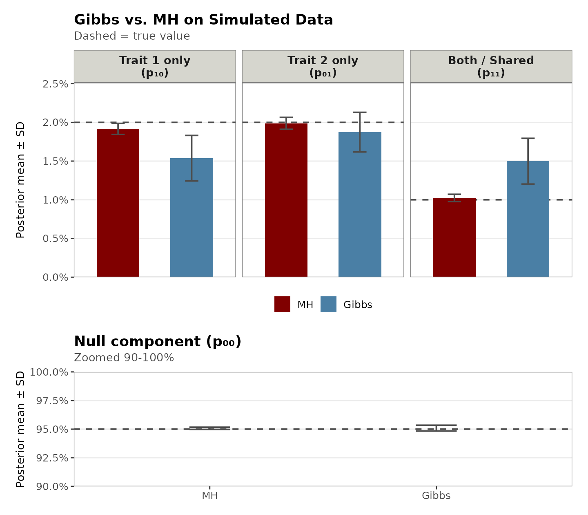
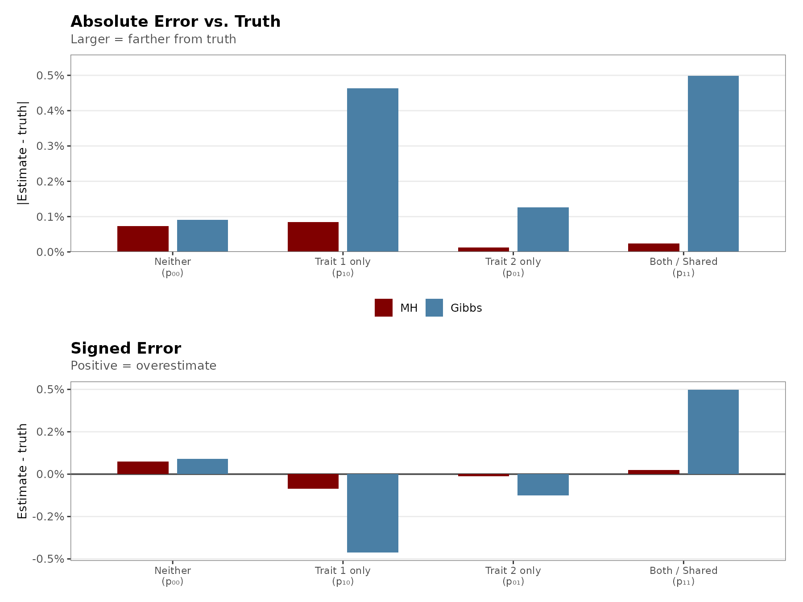
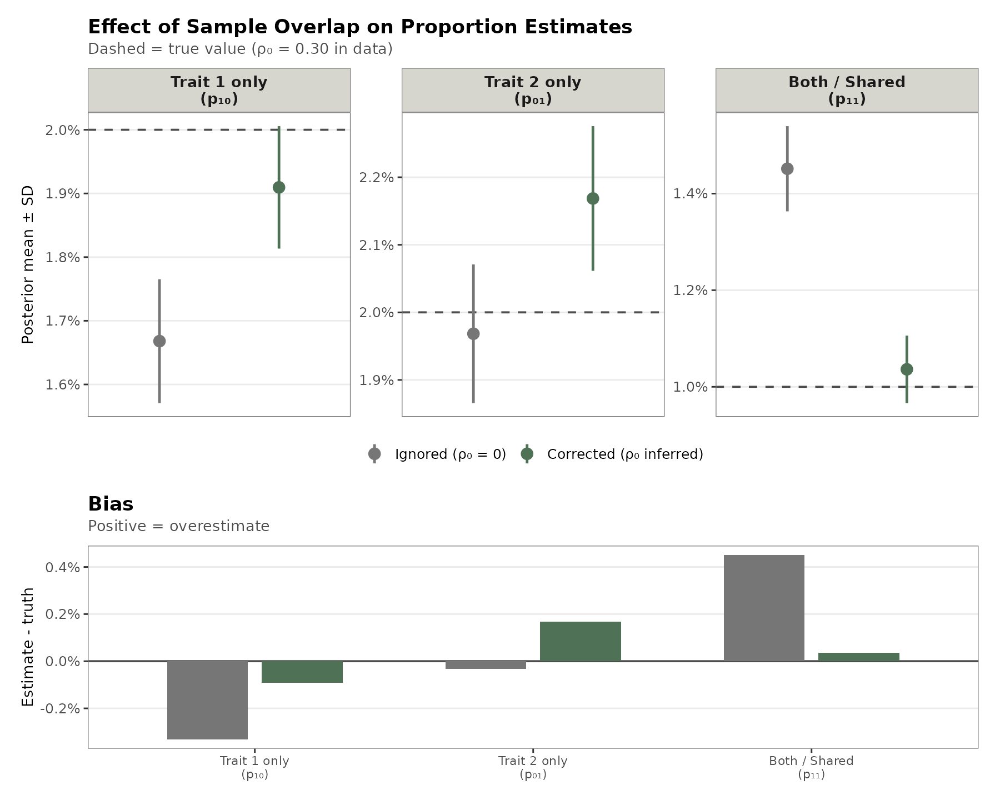
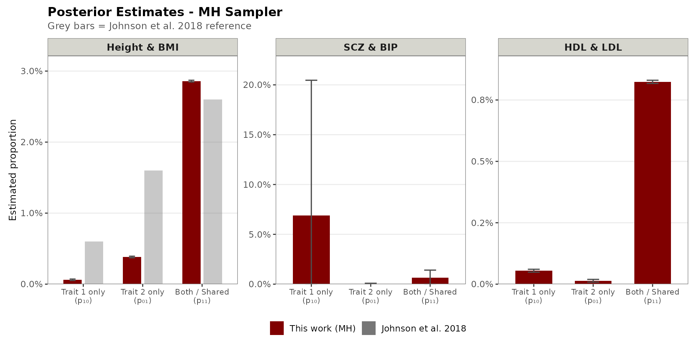
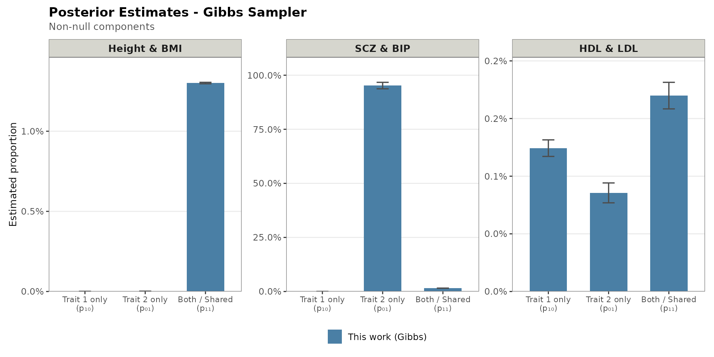
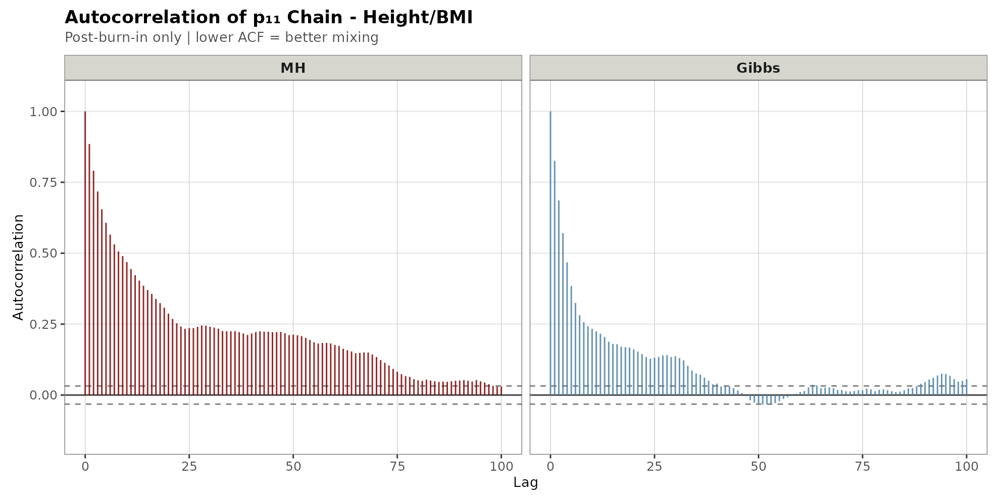

# Extending UNITY: Adaptive MCMC Sampling and Sample Overlap Correction Improves Inference of Shared Genetic Architecture Across Complex Traits

Nasser Elhajjaoui, Committee on Genetics, Genomics, & Systems Biology, University of Chicago  
_HGEN48600: Fundamentals of Computational Biology_

---

## Overview

[UNITY](https://academic.oup.com/bioinformatics/article/34/13/i195/5045708) (Johnson et al. 2018) is a Bayesian framework for estimating the proportion of shared and trait-specific causal variants between pairs of complex traits using GWAS summary statistics. It models the genetic architecture as a four-component mixture over SNPs, parameterized by:

| Parameter | Meaning                                                    |
| --------- | ---------------------------------------------------------- |
| p₀₀       | Proportion of SNPs causal for **neither** trait            |
| p₁₀       | Proportion causal for **trait 1 only**                     |
| p₀₁       | Proportion causal for **trait 2 only**                     |
| p₁₁       | Proportion causal for **both** traits (shared)             |

This repository contains a complete Python 3 reimplementation of UNITY (`UNITYv2.py`) with three extensions addressing core limitations. Figures from the analysis are included in `Figures/`.

---

## Table of Contents

- [Motivation and Limitations of Original UNITY](#motivation-and-limitations-of-original-unity)
- [Extensions](#extensions)
  - [Adaptive Metropolis-Hastings](#1-adaptive-metropolis-hastings)
  - [Data-Augmented Gibbs Sampler](#2-data-augmented-gibbs-sampler)
  - [Sample Overlap Correction](#3-sample-overlap-correction)
- [Code Improvements](#code-improvements)
- [Results](#results)
  - [Simulation Validation](#simulation-validation)
  - [Sample Overlap Correction](#sample-overlap-correction-results)
  - [Real GWAS Benchmarks](#real-gwas-benchmarks)
  - [Gibbs vs MH on Real Data](#gibbs-vs-mh-on-real-data)
- [Figures](#figures)
- [Usage](#usage)
- [References](#references)

---

## Motivation and Limitations of Original UNITY

Benchmarking the original implementation on real GWAS data revealed three concrete problems:

**1. Near-zero MCMC acceptance rates.**
The original fixed proposal (B = 10) gives acceptance rates below 1% with M > 100K SNPs. Chains can stay stuck at a single value for hundreds of iterations, producing posteriors with zero standard deviation.

**2. Inconsistent hyperparameter sourcing.**
UNITY takes h² and ρ as fixed inputs, typically from LDSC. LDSC assumes an infinitesimal model (all variants are causal) while UNITY models a sparse architecture (non-infinitesimal). Using one to inform the other creates a mismatch in the per-component variance terms.

**3. No sample overlap correction.**
Many GWAS consortia (PGC, GIANT) share control cohorts across studies. Unmodeled overlap creates spurious cross-trait correlation that the model absorbs into p₁₁.

---

## Extensions

### 1. Adaptive Metropolis-Hastings

Proposal: `Dir(κ + B · p_current)` with κ = 0.2 (Dirichlet prior). B starts at 100 and adapts every 50 iterations during burn-in to target ~25% acceptance, then is fixed for the rest of the run.

- If acceptance rate < 15%: `B ← B × 1.5`
- If acceptance rate > 35%: `B ← B / 1.5`

The acceptance ratio includes the asymmetric proposal correction (the original did not):

```
α = min(1, π(θ*) · q(θ_current | θ*) / π(θ_current) · q(θ* | θ_current))
```

This is the primary sampler used for all real GWAS analyses.

### 2. Data-Augmented Gibbs Sampler

Adds latent per-SNP class labels `c_m ∈ {00, 10, 01, 11}` to break the posterior into simpler conditional updates. Each iteration:

- **Block 1 (exact):** Sample `c_m | p, z` for all M SNPs from a categorical distribution
- **Block 2 (MH):** Propose and accept/reject `p*` using the conditional likelihood given the class labels
- **Block 3 (optional):** MH update for ρ₀ if inferring sample overlap

Acceptance rates are much higher on simulated data, but the sampler collapses on real GWAS data — see [Gibbs vs MH on Real Data](#gibbs-vs-mh-on-real-data).

### 3. Sample Overlap Correction

Adds a parameter ρ₀ that models baseline correlation between traits at non-causal SNPs (similar to the LDSC intercept). The null component covariance becomes:

```
Σ₀₀ = diag(σ²_e1, σ²_e2) + ρ₀√(σ²_e1 · σ²_e2) · off-diag
```

All other component covariances inherit this baseline. ρ₀ can be:

- **Fixed** at a value estimated externally (e.g., from LDSC intercept)
- **Inferred** jointly within the MCMC via `--infer_rho0` (Block 3 of the Gibbs sampler, or an additional MH step for the adaptive MH method)

---

## Code Improvements

| Aspect               | Original (Python 2)                              | UNITY v2 (Python 3)                            |
| -------------------- | ------------------------------------------------ | ---------------------------------------------- |
| **Throughput**       | ~4.7 iterations/sec                              | ~35 iterations/sec (~7x faster)                |
| **Likelihood**       | `scipy.stats.multivariate_normal` called per-SNP | Custom vectorized 2x2 bivariate normal log-pdf |
| **Numerics**         | Mixed probability/log space                      | Full `logsumexp` throughout                    |
| **Input validation** | None                                             | Scale check warns if Z-scores passed as betas  |
| **Compatibility**    | Python 2                                         | Python 3.8+                                    |

The ~7x speedup comes from replacing the per-SNP scipy call with a vectorized 2x2 bivariate normal that runs on all M SNPs at once.

---

## Results

### Simulation Validation

Simulated data matching the Height/BMI parameter regime (M = 100K, N₁ = 252K, N₂ = 339K, h²₁ = 0.239, h²₂ = 0.157, ρ = 0.085). True proportions: p₀₀ = 0.95, p₁₀ = 0.02, p₀₁ = 0.02, p₁₁ = 0.01.

| Parameter           | Adaptive MH   | Gibbs         | True  |
| ------------------- | ------------- | ------------- | ----- |
| p₀₀                 | 0.952 ± 0.003 | 0.950 ± 0.002 | 0.950 |
| p₁₀                 | 0.013 ± 0.003 | 0.017 ± 0.002 | 0.020 |
| p₀₁                 | 0.018 ± 0.003 | 0.019 ± 0.002 | 0.020 |
| p₁₁                 | 0.016 ± 0.003 | 0.014 ± 0.002 | 0.010 |
| **Acceptance rate** | ~3%           | ~24%          | -     |

Both methods recover the true parameters within uncertainty on clean simulated data. The Gibbs sampler achieves 8x higher acceptance and tighter posterior intervals.





### Sample Overlap Correction Results

Simulated data with ρ₀ = 0.30 sample overlap (N₁ = N₂ = 100K, h²₁ = h²₂ = 0.25, ρ = 0). True proportions: p₀₀ = 0.95, p₁₀ = 0.02, p₀₁ = 0.02, p₁₁ = 0.01.

| Parameter           | Overlap ignored | Overlap inferred | True  |
| ------------------- | --------------- | ---------------- | ----- |
| p₀₀                 | 0.963           | 0.950            | 0.950 |
| p₁₀                 | 0.001           | 0.007            | 0.020 |
| p₁₁                 | 0.019           | 0.022            | 0.010 |
| ρ₀                  | (not modeled)   | 0.302 ± 0.003    | 0.300 |
| **Acceptance rate** | 0.65%           | 63.0%            | -     |

When ρ₀ = 0.30 exists but is not modeled, spurious cross-trait correlation is absorbed into p₁₁ (nearly doubled), p₁₀ collapses to near zero, and the chain freezes. With `--infer_rho0`, the model correctly recovers ρ₀ ≈ 0.30 and proportion estimates improve substantially.



### Real GWAS Benchmarks

All runs: adaptive MH sampler, 5,000 iterations, 25% burn-in.

#### Height & BMI (GIANT)

| Parameter         | This work (MH) | Johnson et al. 2018 |
| ----------------- | -------------- | ------------------- |
| p₀₀               | 0.967          | 0.952               |
| p₁₀ (height-only) | 0.001          | 0.006               |
| p₀₁ (BMI-only)    | 0.004          | 0.016               |
| p₁₁ (shared)      | **0.029**      | **0.026**           |

The shared component estimate (p₁₁ = 0.029) closely matches the published result (0.026). The lower total causal proportion (~3.3% vs ~4.8%) is likely due to differences in LD-pruning strategy (approximate 10th-SNP selection vs exact 5KB windows) and GWAS versions.

#### SCZ & BIP (PGC)

| Parameter      | MH estimate | Interpretation                |
| -------------- | ----------- | ----------------------------- |
| p₀₀            | 0.924       | >92% of variants non-causal   |
| p₁₀ (SCZ-only) | 0.069       | ~7.0% unique                  |
| p₁₁ (shared)   | 0.006       | ~0.6% shared causal           |

Despite high genetic corrrelation (ρ = 0.68), the model finds few shared causal variants. However, it correctly infers a stronger genetic signal in schizophrenia. 

#### HDL & LDL (GLGC)

| Parameter    | MH estimate | Interpretation |
| ------------ | ----------- | -------------- |
| p₀₀          | 0.991       | ~99.1% null    |
| p₁₁ (shared) | 0.008       | ~0.8% shared   |

With ρ = −0.10, the model finds minimal sharing and mostly independent genetic architectures, consistent with HDL and LDL being regulated by largely distinct biological pathways with overlap at key loci (PCSK9, APOE, CETP).



### Gibbs vs MH on Real Data

On real GWAS data, the Gibbs sampler can become trapped in an asymmetric mode where most non-null signal is assigned to one of the trait-specific components. The most extreme case was SCZ & BIP (p₀₁ ≈ 0.964).

This is likely due to the Gibbs updates creating a feedback loop between latent SNP assignments and mixture proportions (once one block assigns many SNPs to a single component, the next block updates the proportions to favor that same component even more strongly and the chain eventually gets stuck). This may be a result of weak biological signal due to the conservative LD-pruning step limiting the number of SNPs available. Potential fixes include replacing the symmetric Dirichlet prior on p with an informed, weakly non-uniform prior or introducing a better LD-based pruning approach to perserve more signal in the original GWAS datasets. 





---

## Figures

| Figure             | File                           | Description                                                          |
| ------------------ | ------------------------------ | -------------------------------------------------------------------- |
| MH Trace Grid      | `fig00_mhTraces.png`           | Trace plots for all 3 GWAS pairs under MH                            |
| Gibbs Trace Grid   | `fig00_gibbsTraces.png`        | Trace plots for all 3 GWAS pairs under Gibbs                         |
| Sim Validation     | `fig01_simValidation.png`      | MH vs Gibbs vs truth on simulated data                               |
| Sim Error          | `fig02_simError.png`           | Absolute and signed error highlighting Gibbs underperformance        |
| Overlap Correction | `fig03_overlapCorrection.png`  | Pointrange + bias panels for ρ₀ correction demo                      |
| MH Posteriors      | `fig04_posteriorMH.png`        | Posterior estimates across trait pairs, MH, with published reference |
| Gibbs Posteriors   | `fig05_posteriorGibbs.png`     | Posterior estimates across trait pairs, Gibbs                        |
| ACF                | `fig06_AutocorrelationP11.png` | Autocorrelation of p₁₁ chain: MH vs Gibbs                            |

Individual per-run trace plots are saved as `trace_{id}.png`.

---

## Usage

### Downloading and preprocessing GWAS data

```bash
bash prepareData.sh
```

Downloads the GIANT and GLGC files and runs `prepGWAS.R`. PGC files (SCZ, BIP) can be downloaded from https://pgc.unc.edu/for-researchers/download-results/.

### Running all analyses

```bash
bash runUNITY.sh
```

This runs both samplers on all three trait pairs and the four simulation scenarios.
Individual runs can also be launched directly:

```bash
# Height/BMI, adaptive MH
M=$(wc -l < data/height_betahat.txt)
python UNITYv2.py \
  --file1 data/height_betahat.txt \
  --file2 data/bmi_betahat.txt \
  --N1 251631 --N2 339224 \
  --H1 0.239 --H2 0.157 --rho 0.085 \
  --M $M --ITS 3000 --method mh \
  --id height_bmi_mh

# Simulation with sample overlap correction
python UNITYv2.py --sim \
  --A00 0.95 --A10 0.02 --A01 0.02 --A11 0.01 \
  --N1 100000 --N2 100000 \
  --H1 0.25 --H2 0.25 --rho 0.0 \
  --rho0_sim 0.3 --infer_rho0 \
  --M 100000 --ITS 3000 --method mh \
  --id sim_overlap_inferred
```

### Key arguments

| Argument             | Description                                            |
| -------------------- | ------------------------------------------------------ |
| `--file1`, `--file2` | Single-column effect size files (one betahat per line) |
| `--N1`, `--N2`       | Sample sizes (use effective N for case-control)        |
| `--H1`, `--H2`       | SNP heritabilities (from LDSC)                         |
| `--rho`              | Genetic correlation (from LDSC)                        |
| `--M`                | Number of SNPs (set to `wc -l` of input file)          |
| `--ITS`              | Total MCMC iterations                                  |
| `--method`           | `mh` or `gibbs`                                        |
| `--infer_rho0`       | Jointly infer sample overlap parameter                 |
| `--rho0_sim`         | Simulate with this level of sample overlap             |
| `--sim`              | Run in simulation mode                                 |
| `--seed`             | Random seed (default: 486)                             |
| `--id`               | Output file identifier                                 |

### Output files

Each run produces three files:

```
out.{id}.{seed}.txt          # Text summary
out.{id}.{seed}_chain.txt    # Full MCMC chain (p00 p10 p01 p11 rho0)
out.{id}.{seed}.json         # Structured JSON with config + results + diagnostics
```

---

## GWAS Data Sources

| Trait  | Study                  | N        | h²    | Source |
| ------ | ---------------------- | -------- | ----- | ------ |
| Height | Wood et al. 2014       | 251,631  | 0.239 | GIANT  |
| BMI    | Locke et al. 2015      | 339,224  | 0.157 | GIANT  |
| SCZ    | Trubetskoy et al. 2022 | 58,749\* | 0.240 | PGC3   |
| BIP    | Mullins et al. 2021    | 50,981\* | 0.200 | PGC    |
| HDL    | Willer et al. 2013     | 93,561   | 0.120 | GLGC   |
| LDL    | Willer et al. 2013     | 89,138   | 0.120 | GLGC   |

\*Effective sample size: 4 / (1/N_cases + 1/N_controls)

Heritabilities and genetic correlations are drawn from published LDSC estimates in the respective papers.

---

## Limitations and Next Steps

- **Fixed h² and ρ.** The model takes heritability and genetic correlation as fixed inputs from LDSC. The next step is to jointly estimate them within MCMC to avoid the need for LDSC estimates.
- **LD-pruning approximation.** Taking every Nth SNP is a rough stand-in for proper LD-based pruning. The value of M directly affects the per-SNP signal variance, so all proportion estimates are sensitive to this choice.
- **Gibbs collapsing bias.** The data augmentation works well on simulated data but collapses on real GWAS data. The underlying identifiability issue may require also augmenting with latent effect sizes.

---

## References

1. Johnson R, Shi H, Pasaniuc B, Sankararaman S. A unifying framework for joint trait analysis under a non-infinitesimal model. _Bioinformatics_. 2018;34(13):i195-i201.
2. Bulik-Sullivan B, et al. An atlas of genetic correlations across human diseases and traits. _Nat Genet_. 2015;47:1236-1241.
3. Wood AR, et al. Defining the role of common variation in the genomic and biological architecture of adult human height. _Nat Genet_. 2014;46:1173-1186.
4. Locke AE, et al. Genetic studies of body mass index yield new insights for obesity biology. _Nature_. 2015;518:197-206.
5. Trubetskoy V, et al. Mapping genomic loci implicates genes and synaptic biology in schizophrenia. _Nature_. 2022;604:502-508.
6. Mullins N, et al. Genome-wide association study of more than 40,000 bipolar disorder cases. _Nat Genet_. 2021;53:817-829.
7. Willer CJ, et al. Discovery and refinement of loci associated with lipid levels. _Nat Genet_. 2013;45:1274-1283.
8. Berisa T, Pickrell JK. Approximately independent linkage disequilibrium blocks in human populations. _Bioinformatics_. 2016;32:283.

